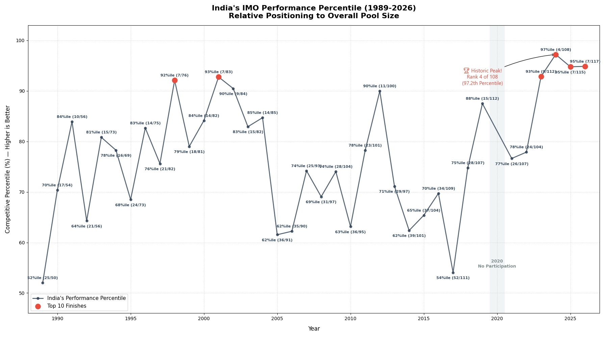
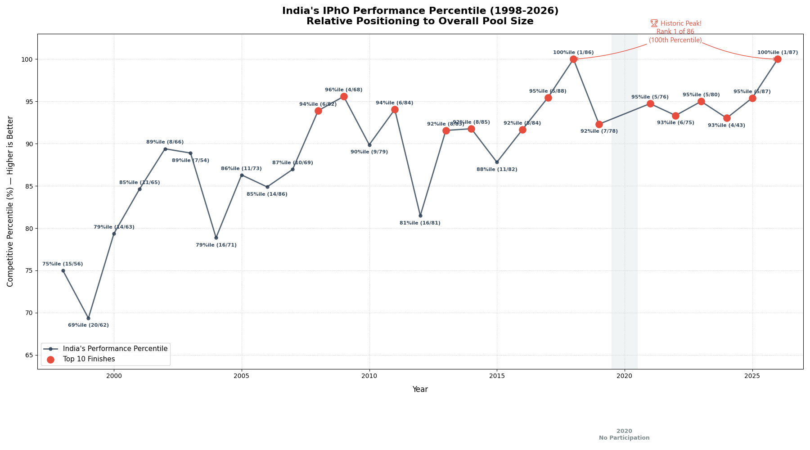
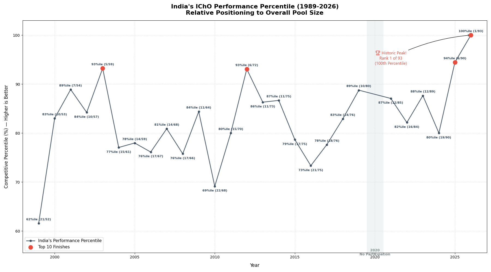
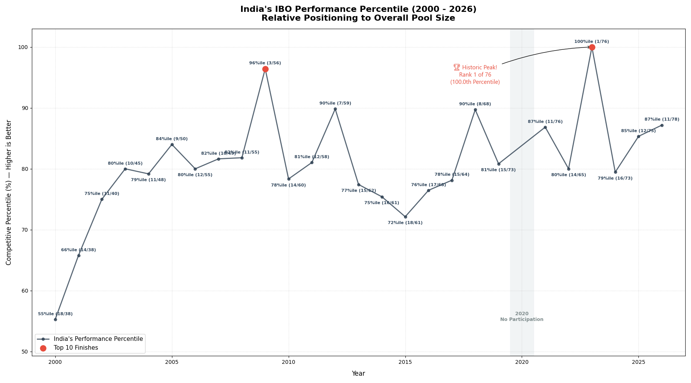
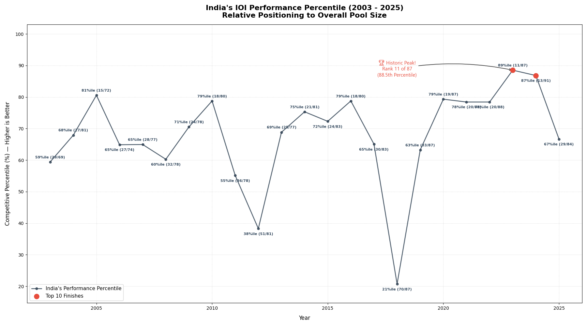
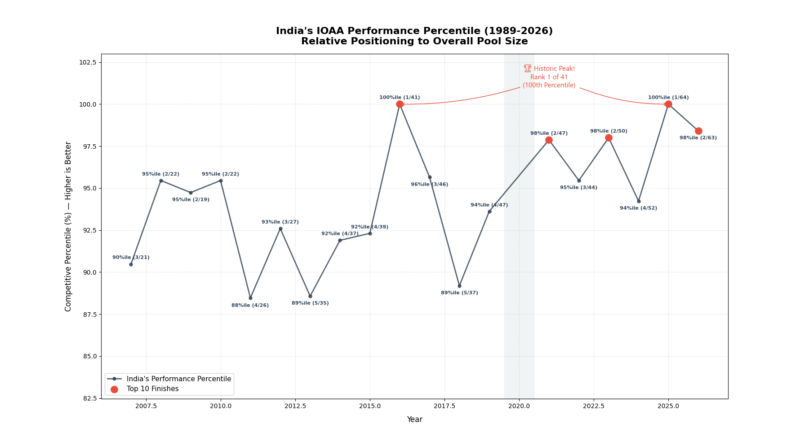

  

  
  
  
  

# 🇮🇳 India Performance in Science Olympiads 🏅

**A comprehensive visual representation and statistical analysis of India's performance across various International Science Olympiads.**

Discover insights, trends, and percentiles for Indian students in globally recognized competitions like IMO, IPhO, IChO, IBO, IOI, and IOAA. This repository serves as a data-driven overview of India's excellence in international academics.

## 🧮 India in International Mathematical Olympiad (IMO) Percentile

## 🔭 India in International Physics Olympiad (IPhO) Percentile

## 🧪 India in International Chemistry Olympiad (IChO) Percentile

## 🧬 India in International Biology Olympiad (IBO) Percentile

## 💻 India in International Informatics Olympiad (IOI) Percentile

## 🌌 India in International Olympiad on Astronomy and Astrophysics (IOAA) Percentile

